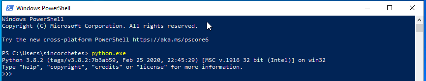
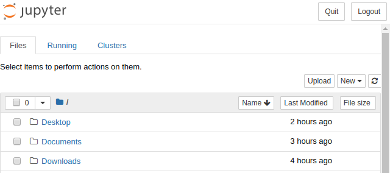
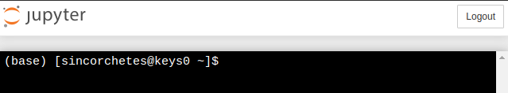

# Introducción y preparación del entorno

# Historia
Python es un lenguaje de programación interpretado, de alto nivel y de interés general. Este lenguaje tiene una filosofía de programación que se centra en la legibilidad del código, para ello implementa una serie de declaraciones y estándares que ha de respetarse para que el código funcione como es la indentación. Python es un lenguaje orientado a objetos que facilitan a los desarrolladores escribir un código limpio, eficaz, lógico y pequeño que sirve tanto para pequeños, como medianos y grandes proyectos.

La primera versión de Python se publicó en el año 1991 por Guido van Rossum un programador holandés graduado en matemáticas y ciencias computacionales en la universidad de Amsterdam en 1982. Posteriormente se publicó la versión 2.0 el día 16 de octubre del año 2000 y la versión 3.0 que se liberó el 3 de diciembre de 2008. Actualmente las versiones 1.0 y 2.0 ya no están soportadas, esta última dejó de tener soporte el día 31 de diciembre de 2019.

# Notas importantes
Antes de seguir con este artículo es muy importante que sepamos que la versión con la que trabajaremos en las siguientes entragas es *Python 3*. Python 2.7 no tiene más soporte desde el <u>31 de diciembre del 2019</u>. 

A parte de la versión, conviene saber que tenemos que leer mucho la <a href="https://docs.python.org/3" target="blank"> documentación oficial (_inglés_)</a> si no queremos perder horas y horas con las clásicas pruebas de Error/Acierto (_pruebo cosas al azar y lo que salga salió_).

También tenemos muchos recursos en línea como <a href="https://realpython.com" target="blank">Real Python (_inglés_)</a> que contienen muchos recursos bastante bien explicados; <a href="https://www.fullstackpython.com/best-python-resources.html" target="blank" >Full Stack Python (_inglés_)</a> tiene tambień muchos recursos, ayudas...

# Instalación
Python por norma general está instalado por defecto en el 99% de distribuciones de Linux por lo que no te hará falta tener que instalar nada. Sin embargo, hay distribuciones que a pesar de que Python 2.* se encuentre obsoleto, la mayor parte de librerías y programas que contienen en su sistema operativo hacen uso de la versión 2.7.* que fue la última en mantenerse. Por lo que, quizás necesites realizar unos pasos adicionales para tener Python 3.* instalado en tu Linux.

Algunas distribuciones pueden ser:
* CentOS 6/7, hay que hacer uso de Software Collections puedes hacer uso de esta guía que <a href="" target="blank">  elaboré.</a>
* Debian Stable
* RHEL 6/7
* Gentoo

En FreeBSD y OpenBSD hay que instalarlo con su respectiva paquería, puedes utilizar estas guía oficial de Python para <a href="https://docs.python.org/3/using/unix.html#on-freebsd-and-openbsd" target="blank">hacerlo.</a>

En Windows tenemos dos formas de hacerlo, una es utilizando el subsistema de Linux para Windows haciendo uso de un sistema Linux ejecutándose en un Windows, o bien, la forma oficial que es utilizar el instalador oficial elaborado por la comunidad de Python. Para descarganos el instalador hay que dirigirse a la página de descargas <a href="https://www.python.org/downloads/" target="blank"> pulsando aquí.</a>

Una vez descargado, ejecutamos el instalador y seguimos los pasos como tenemos en las imágenes:

Desmarcamos la opción de instalar para todos y marcamos la opción de añadir a la variable PATH, después "Install Now":

Vemos como se está instalando:

En este paso, deshabilitamos el path lenght limit:

Y desde PowerShell podemos abrir el ejecutable directamente, veremos la versión que estamos utilizando.

# IDEs
Hay una gran selección de IDEs bastante buenos que podemos utilizar para aprender, hay tanto de pago, gratuitos, libres y no libres... hay un gran abanico para decidir.

### IDLE
Un IDE que viene integrado con Python (_incluyendo en la instalación de Windows en la que hemos hablado más arriba_). Permite ejecutar código directamente, depurarlo y tiene un pequeño editor dónde realizar nuestras modificaciones.

### Spyder
Es un IDE gratuito y libre que contiene multitud de funciones desde depuración, ejecución y redacción de un archivo en Python todo en una misma ventana. Pues ver <a href="https://www.spyder-ide.org" target="blank">más info aquí.</a>

### Jupyter Notebook
Es un servidor web que mediante estilos, javascripts y html5 genera un IDE web con el que poder interactuar, al igual que todos permite depurar, crear archivos, navegar por los directorios del sistema operativo...etc <a href="https://jupyter.org" target="blank">Más info</a>

Navegando por los directorios del SO desde su interfaz web

Ejecutando comandos de Python en un archivo nuevo

Abriendo una sesión de SO desde Web

### Jupyter labs
Basado en Jupyter Notebook y Arquitecture contiene más características, como especificar qué versión de Python lanzar, ejecutar una consola directamente de Python o de SO... <a href="https://jupyter.org" target="blank">Más info.</a>

### Anaconda
Anaconda es un software que contiene todo lo necesario para desplegar un entorno de desarrollo de Python tanto en Linux como en Windows. No solo contiene el intérprete, si no que también tienen varios editores que puedes seleccionar desde su panel "Anaconda Navitator". <a href="https://www.anaconda.com" target="blank">Más info.</a>

### PyCharm
PyCharm es un software elaborado por la empresa JetBrains, es bastante conocido porque tiene un potente interfaz de desarrollo que permite hacer carga de espacios de nombres, módulos, referencias... y es muy potente. Aunque es de pago, si eres estudiante y tienes la <a href="https://isic.org" target="blank">ISIC</a> puedes obtener una licencia anual gratuita para todos los productos de la empresa como DataGrid, PhpStorm, CLion... y poder hacer tus desarrollos (_siempre personales y no comerciales_) con él. 
No obstante, si no eres estudiante, y no quieres comprar la licencia, puedes hacer uso de la versión comunitaria.<a href="https://www.jetbrains.com/es-es/pycharm/download/" target="blank">Más info.</a>

# Editores
Si no te gusta utilizar un IDE, siempre puedes hacer uso de editores como <a href="https://www.vim.org" target="blank">vim</a>, <a href="https://www.sublimetext.com" target="blank">Sublime Text</a>, <a href="https://code.visualstudio.com" target="blank">VSCode</a> con sus correspondientes plugins.
